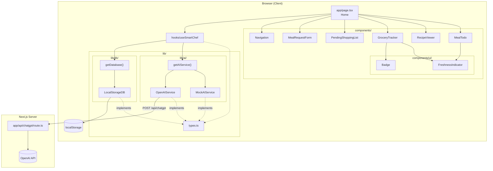
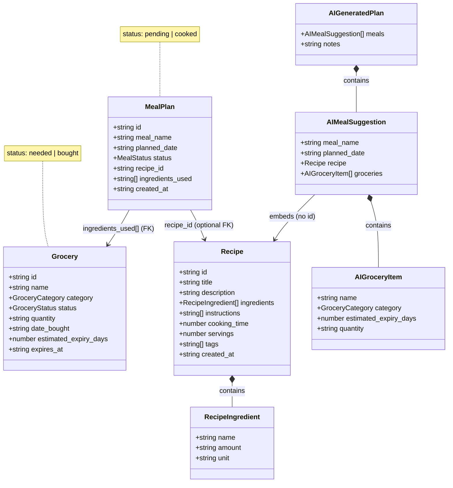
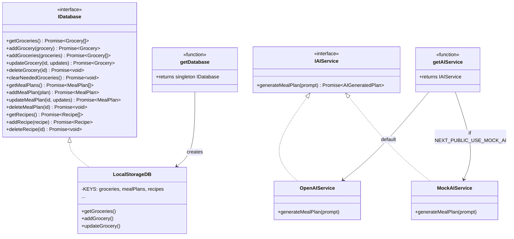
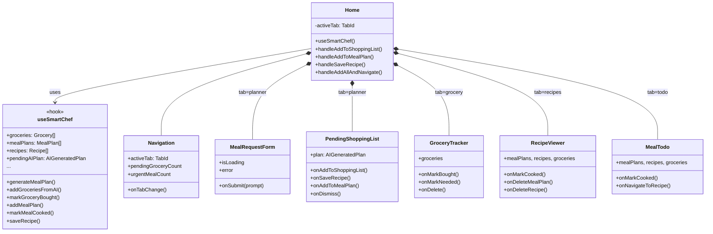
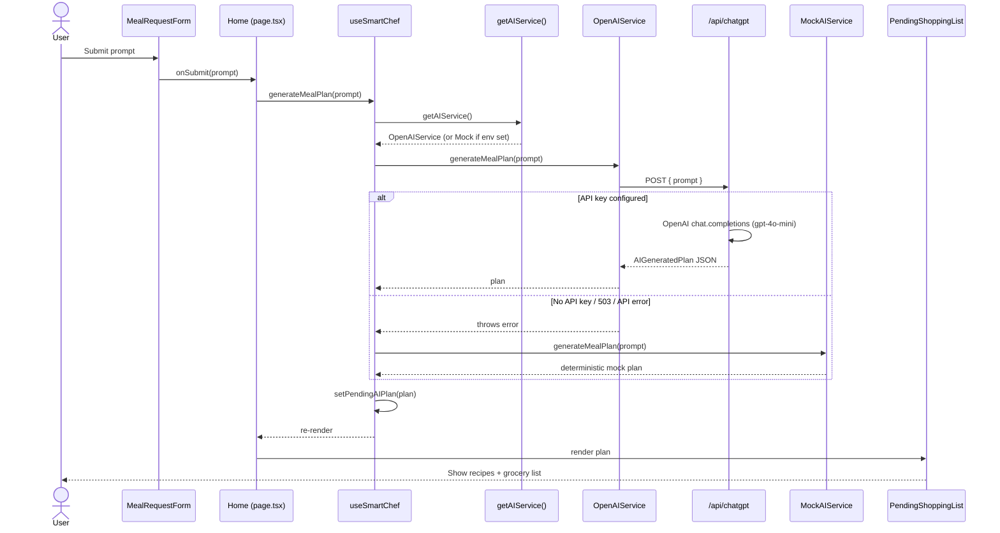
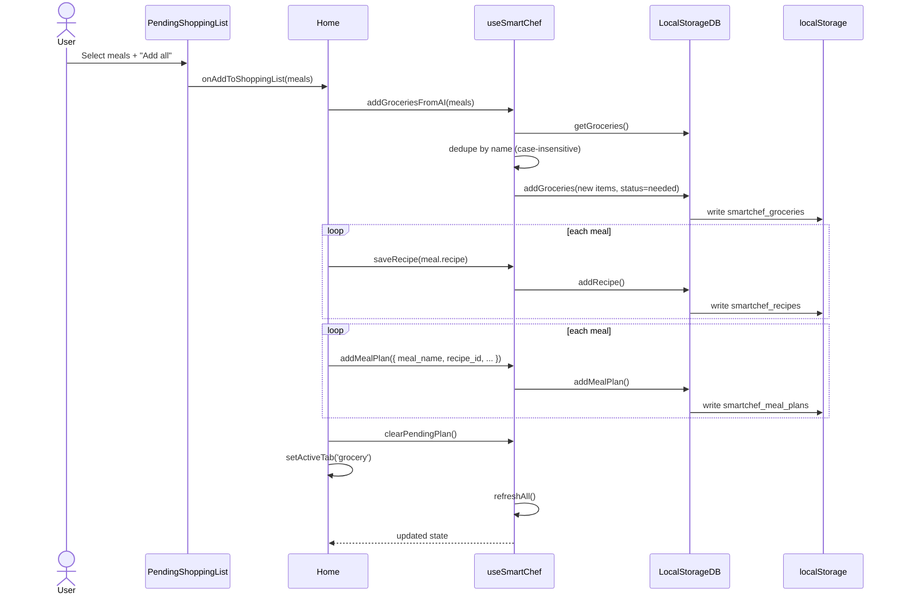
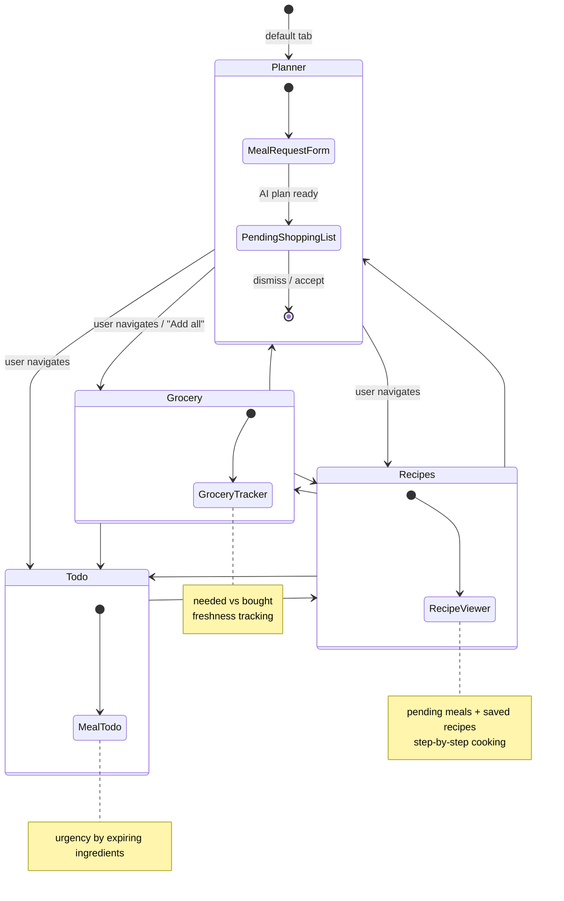

# SmartChef Architecture

SmartChef is a Next.js meal-planning app with a layered architecture: **UI → hook → services (AI + DB) → browser localStorage / OpenAI API**.

## Project Structure

| Layer | Path | Role |
|-------|------|------|
| **App shell** | `app/layout.tsx`, `app/page.tsx` | Root layout + main SPA page |
| **API** | `app/api/chatgpt/route.ts` | Server-side OpenAI proxy |
| **State** | `hooks/useSmartChef.ts` | Central state + all CRUD/AI actions |
| **UI** | `components/*.tsx` | Tab-specific views |
| **Domain** | `lib/types.ts` | Types + `IDatabase` / `IAIService` interfaces |
| **Persistence** | `lib/db/localStorageDB.ts` | Browser localStorage (swappable) |
| **AI** | `lib/ai/openaiService.ts`, `mockAIService.ts` | Real API vs fallback mock |

## Design Patterns

1. **Singleton factories** — `getDatabase()` and `getAIService()` return shared instances.
2. **Interface segregation** — `IDatabase` and `IAIService` let you swap localStorage → Supabase/Prisma or OpenAI → another provider without touching UI code.
3. **Graceful AI fallback** — OpenAI errors (missing key, 503) trigger `MockAIService`.
4. **Single source of truth** — `useSmartChef` owns all app state; components are mostly presentational.

---

## 1. High-Level Component Diagram

Shows the main layers and how they connect.

---

## 2. Domain Model (Class Diagram)

Core entities and how they relate.

---

## 3. Service Interfaces & Implementations

The project uses the **Strategy + Factory** pattern so DB and AI backends can be swapped.

---

## 4. React Component Structure

How `page.tsx` composes the UI and passes data down.

---

## 5. Sequence: AI Meal Plan Generation

What happens when the user submits a prompt on the Meal Planner tab.

---

## 6. Sequence: Accept AI Plan → Grocery + Recipes + Meal Plans

What happens when the user clicks "Add to shopping list" for selected meals.

---

## 7. Tab Navigation & Data Flow

How the four tabs map to features.

---

## Viewing the Diagrams

These diagrams use [Mermaid](https://mermaid.js.org/) syntax. They render automatically in:

- GitHub / GitLab markdown previews
- VS Code / Cursor with a Mermaid preview extension
- Many documentation tools (Notion, Obsidian, etc.)

To export as images, paste a diagram into the [Mermaid Live Editor](https://mermaid.live/) and download as PNG or SVG.
